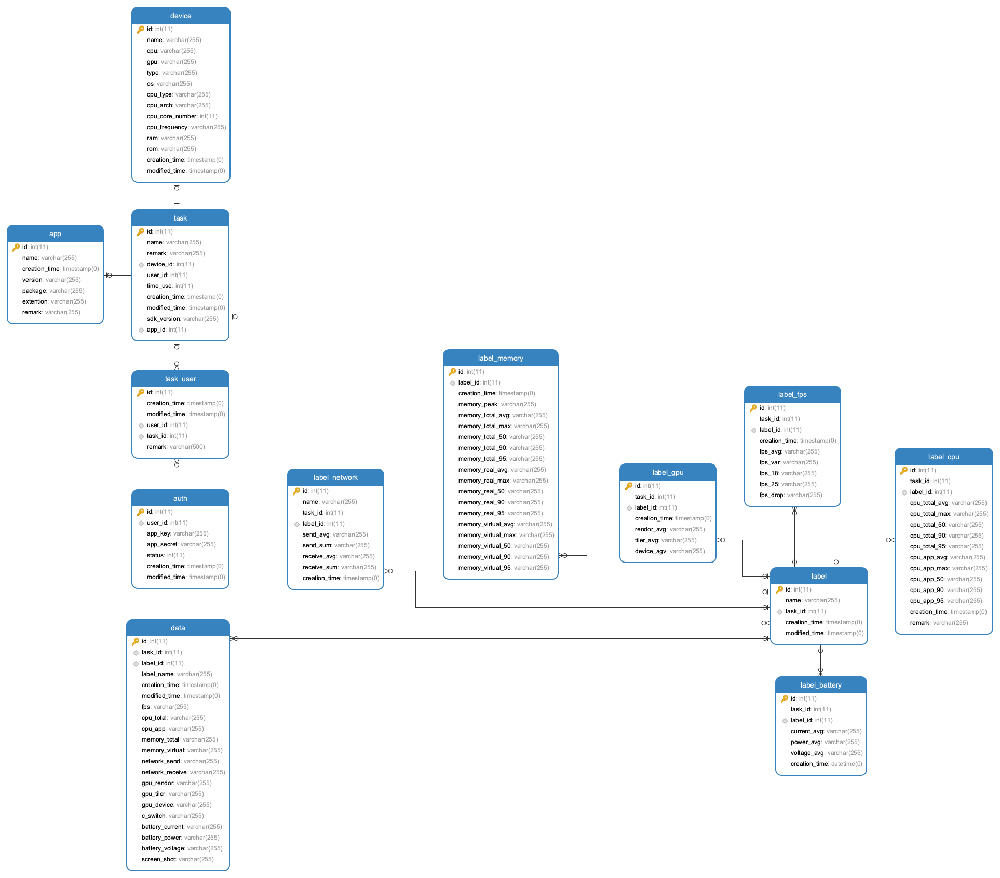

# datasource

性能数据收集平台后端项目，目前包含了 **性能数据** 收集存储。

- 支持高并发
- 大数据分表存储
- 提供开放式 API
- 提供 SDK 配合使用
- 其他

## OpenSource DataSource Platform

整合了 Gin 框架和其他的通用功能，包括：

> 中间件

- logger ：使用 logrus 构建
- auth ：鉴权模块，使用 key 和 secret 进行校验
- exception ： 重写 gin.Recovery() 中间件，提供了统一的 panic 捕捉

> HandlerFunc

- NoMethodHandler ： 重写 gin.NoMethodHandler()，提供无 对应方法访问 的 统一返回
- NoRouterHandler ： 重写 gin.NoRouterHandler()，提供无 对应路径访问 的 统一返回

> MQ

- 使用 RabbitMq 构建
- 提供 Worker 注册支持

> Consul

- 提供了 consul 的支持
- 提供了 http consul 的服务注册
- 提供了 grpc consul 的服务注册

> App 支持

- 使用 github.com/urfave/cli 构建基础 App
- 提供了 统一的 config 读取文件服务

> transport

- 提供了 http 使用的基础服务

> model

- 提供了 ORM 使用的 Model
- 使用 gorm 构建

> 缓存

- 提供了基于 redis 的 redis pool

> Service

- 提供了基础 service，待完善

> utils

- 提供了一些工具

### Gin

整个项目基于 Gin 框架构建。

## Mysql Model design

